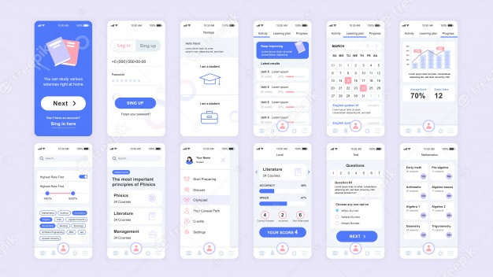
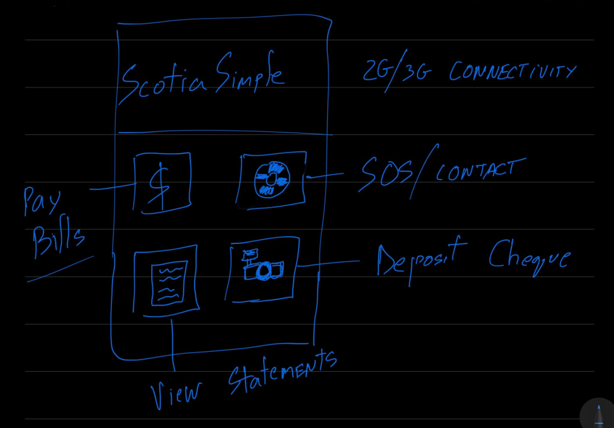

# Finansible

#### The digital divide in Indigenous communities is holding back Canada's economy, as reported by CBC News. To tackle this issue, Scotiabank can adopt a solution that focuses on accessibility and digitization.

The proposed solution is a simplified banking application that is user-friendly for all age groups, particularly for older individuals who do not have a strong grasp of technology. The application aims to provide financial literacy and accessibility to banking information by combining educational aspects and accessibility features. The team will use the MERN stack and Java for coding and graphics, respectively, to ensure the application is lightweight and has excellent graphing functionality.

## Demo

To ensure security, the team proposes that users log in using their card numbers instead of other authentication methods, as this method ensures that the card numbers cannot be misused if the bank's payment records are hacked. Additionally, the team proposes storing users' bank statements on the blockchain for extra security, with an added functionality of exporting the statement as a soft copy for convenience.

The application's dashboard includes a pay bills section that serves as a one-stop-shop for all account information. The team will use Java's visualization libraries, such as XChart and jFreeChart, to build the dashboard's graphics.

Finally, the team proposes implementing smart contracts for the check deposit section, eliminating the risk of manipulation by third parties and providing a more secure method for deposits.

Overall, the team will ensure that the application is easy to navigate and user-friendly, with excellent accessibility features for older individuals. They will also consider security measures such as blockchain and smart contracts to ensure users' data and transactions are secure.

### Architecture

